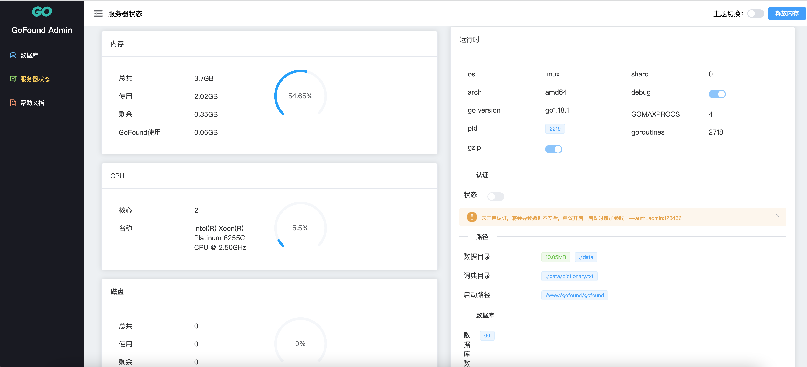

# GoFound

`GoFound` 一个golang实现的全文检索引擎，支持持久化和单机亿级数据毫秒级查找。

接口可以通过http调用。

详见 [API文档](./docs/api.md)

## 文档

+ [示例](./docs/example.md)
+ [API文档](./docs/api.md)
+ [索引原理](./docs/index.md)
+ [配置文档](./docs/config.md)
+ [持久化](./docs/storage.md)
+ [编译部署](./docs/compile.md)

## 在线体验

> Simple社区使用的GoFound，可以直接模糊搜索相关帖子

[在线体验](https://simpleui.72wo.com/search/simpleui)

## GoFound在线管理后台Demo
[http://119.29.69.50:5678/admin](http://119.29.69.50:5678/admin)




## QQ交流群

[556102631](https://qm.qq.com/cgi-bin/qm/qr?k=4OvO7bgRAhSLX0J2WXVbCWbY7hL7gMYd&jump_from=webapi)

## 二进制文件下载

> 支持Windows、Linux、macOS、（amd64和arm64）和苹果M1 处理器

[点击下载](https://github.com/newpanjing/gofound/releases)

## 技术栈

+ 二分法查找
+ 快速排序法
+ 倒排索引
+ 正排索引
+ 文件分片
+ golang-jieba分词
+ leveldb

### 为何要用golang实现一个全文检索引擎？

+ 正如其名，`GoFound`去探索全文检索的世界，一个小巧精悍的全文检索引擎，支持持久化和单机亿级数据毫秒级查找。

+ 传统的项目大多数会采用`ElasticSearch`来做全文检索，因为`ElasticSearch`够成熟，社区活跃、资料完善。缺点就是配置繁琐、基于JVM对内存消耗比较大。

+ 所以我们需要一个更高效的搜索引擎，而又不会消耗太多的内存。 以最低的内存达到全文检索的目的，相比`ElasticSearch`，`gofound`是原生编译，会减少系统资源的消耗。而且对外无任何依赖。

## 安装和启动

> 下载好源码之后，进入到源码目录，执行下列两个命令
>

+ 编译

> 直接下载 [可执行文件](https://github.com/newpanjing/gofound/releases) 可以不用编译，省去这一步。

```shell
go get && go build
```

+ 启动

```shell
./gofound --addr=:8080 --data=./data
```

+ docker部署

```shell
docker build -t gofound .
docker run -d --name gofound -p 5678:5678 -v /mnt/data/gofound:/usr/local/go_found/data gofound:latest
```

+ 其他命令
  参考 [配置文档](./docs/config.md)

## 多语言SDK

> 使用gofound的多语言SDK，可以在不同语言中使用gofound。但是请注意，版本号与gofound需要一致。主版本和子版本号，修订版不一致不影响。

[Java](https://github.com/newpanjing/gofound-java)

[Python](https://github.com/newpanjing/gofound-python)

[Node.js](https://github.com/newpanjing/gofound-nodejs)

其他语言的SDK，正在陆续完善中。也可以直接通过[API文档](./docs/api.md)用HTTP请求实现。

## 和ES比较

| ES          | GoFound               |
|-------------|-----------------------|
| 支持持久化       | 支持持久化                 |
| 基于内存索引      | 基于磁盘+内存缓存             |
| 需要安装JDK     | 原生二进制，无外部依赖           |
| 需要安装第三方分词插件 | 自带中文分词和词库             |
| 默认没有可视化管理界面 | 自带可视化管理界面             |
| 内存占用大       | 基于Golang原生可执行文件，内存非常小 |
| 配置复杂        | 默认可以不加任何参数启动，并且提供少量配置 |


## 待办

[TODO](docs/TODO.md)

## 使用GoFound的用户

[Simple社区](https://simpleui.72wo.com)｜ [贝塔博客](https://www.88cto.com) ｜ [Book360](https://www.book360.cn)

[深圳市十二点科技有限公司](https://www.72wo.com)｜[深圳市恒一博科技有限公司](http://www.hooebo.com)

[西安易神网络信息系统服务有限公司](http://www.hansonvip.com/)

[影视资源搜索](https://movie.ipip.icu)｜[酷易物联](https://cooleiot.tech)｜[French博客](https://hoime.cn/)

[好咪二次元之家](http://hoime.space)

## 发布日志

[发布日志](https://github.com/newpanjing/gofound/releases)
