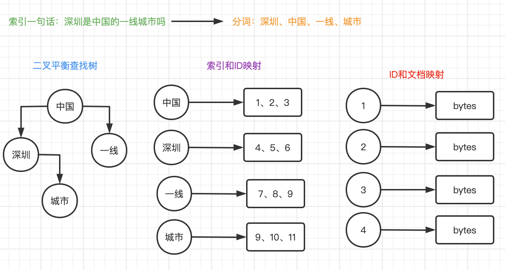

# 索引原理和流程

`gofound` 采用平衡二叉树对文本关键词进行索引，然后利用`leveldb`存储id值，以及对应的文档。

## 原理图

## 二叉平衡查找树

二叉平衡查找树是一个高效的查找树，它的查找速度是`O(log n)`，并且每个节点的子树都是平衡的。
`gofound`默认是分10个文件块，也就是10个平衡查找树，每个平衡查找树的深度是`log10(n)`。

1亿条索引在一颗树查找最大26次，如果10亿数据，最大查找也是26次，会根据key的hash值取模shard数量，来找到对应的索引进行检索。